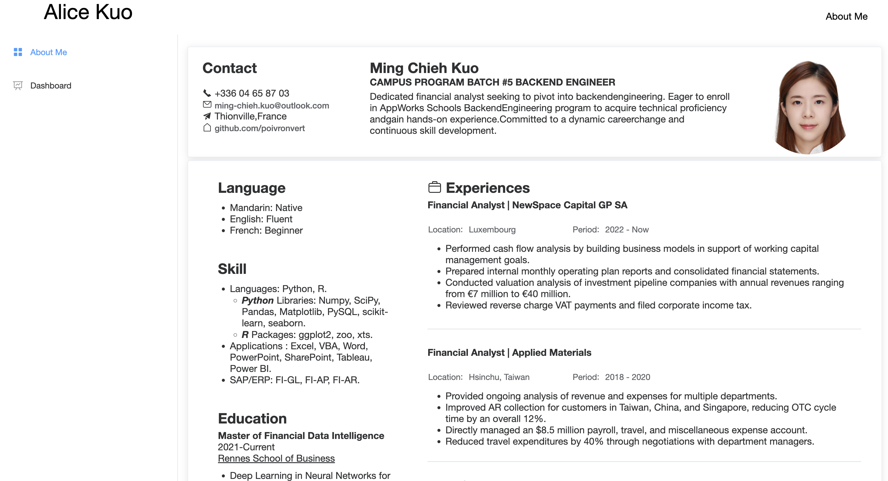
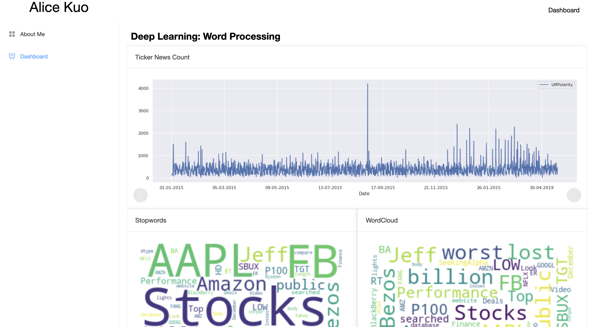
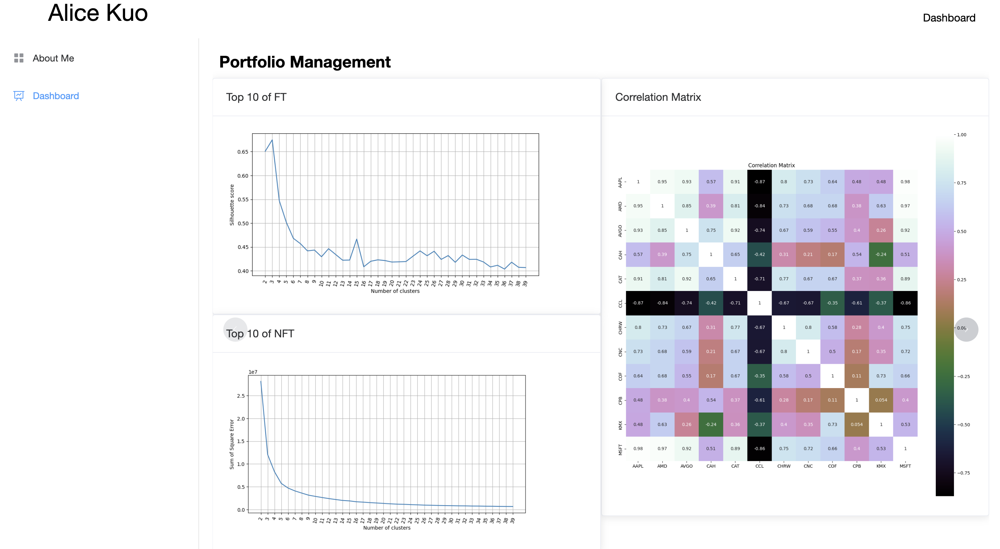

# RSB-DATA-ANALYTICS

## Overview 
In the RSB (Data Science and Business Analytics) classroom, I collaborated with fellow students to undertake a compelling data analysis final project. Our research theme encompassed both text analysis and data analysis applications in the realms of finance and investment. This study delved deep into uncovering latent information in textual data and revealed key trends and insights related to finance and investment through data analysis.

Going beyond traditional data analysis, we successfully employed FastAPI technology to construct a dynamic dashboard. This dashboard not only offers an intuitive overview of our research findings but also enables users to delve into the insights obtained. Through the dashboard, users can effortlessly navigate through various analytical results, gaining a comprehensive understanding of key trends in text analysis and financial investment.

This collaborative effort not only provided us with a profound understanding of the practical aspects of data science and business analytics but also showcased our excellent abilities in data-driven decision-making. We anticipate that this research will serve as a valuable reference for professionals and academics in related fields, while also marking a remarkable conclusion to our learning achievements in the RSB course.

## Demo
**About Me**

**Words Processing**

**Portfolio Management**


## Start Server
The project is wrapped a python package. Download the `.whl` file and install with `pip`. 
```shell

# installation
pip install rsb_data_analytics.whl

# See HELP
python -m rsb_data_analytics run --help
# Usage: python -m rsb_data_analytics run [OPTIONS]
# 
#   Start Web Svc.
# 
# Options:
#   -h, --host TEXT     host IP  [default: localhost]
#   -p, --port INTEGER  Service port  [default: 21116]
#   --help              Show this message and exit.


# Start 
python -m rsb_data_analytics run 
```
Visit web on `http://localhost:21116`

## Powered By  
- Vue
- FastAPI 
- Pandas 
- Seaborn
- Matplotlib
- El-Element

## Copyright  
Copyright © 2023 Alice Kuo. All Rights Reserved.